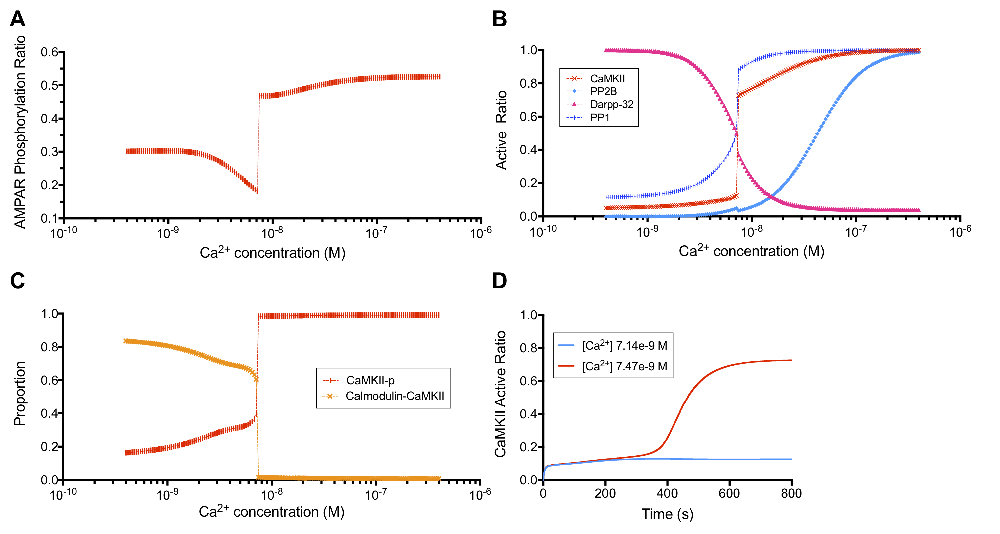

# Multiscale-Synaptic-Model Figure 2

## Components
1. **Model_8-11-Ca-scan.cps**  
	COPASI file used for scanning, Ca was scanned from 4e-10 to 4e-7 M with 151 logarithmic intervals. 

2. **outputs/Normal-4e-10-4e-7-151points.txt**  
	Raw data. The following values were recorded. 
 	[Ca]\_0	Values[AMPAR_bar]	Values[CaMKII_active_ratio]	Values[CaMKIIp_bar]	Values[Dp_bar]	Values[PP1a_bar]	Values[PP2B_bar]

3. **outputs/AMPAR-Ca-Scan.pdf,Key-Species-Scan.pdf,CaMKII-P-Scan.pdf**  
	PDF version of the result.

4. **Model_8-11-Ca-7.14-TIME.cps, Model_8-11-Ca-7.47-TIME.cps**  
	COPASI file used for Time course running, CaMKII active ratio was displayed in 7.14e-9 and 7.47e-9 M concentration. TIME step is 0.0001 and tan 800 s.

5. **outputs/7.14E-9-800S-0.0001s.txtcompress.txt, 7.47E-9-800S-0.0001s.txtcompress.txt**  
	Compressed raw data. The point from the old raw data was sampled to reduce the size of file. (Now 0.1 s resolution). The shape of the curve was not changed.

6. **Log&Compress.py**  
	Python script to compress raw data and can calculate the value of number in log intervals.

7. **outputs/CaCMKII_Time.pdf**  
	PDF version of the result.

## Instruction

1. You can get the scan result by clicking the run button in the Tasks-Parameter Scan in Model_8-11-Ca-scan.cps COPASI file. 

2. You can get the time course result by clicking the run button in the Task-Time Course in Model_8-11-Ca-7.14-TIME.cps, Model_8-11-Ca-7.47-TIME.cps COPASI file. 

## Results
