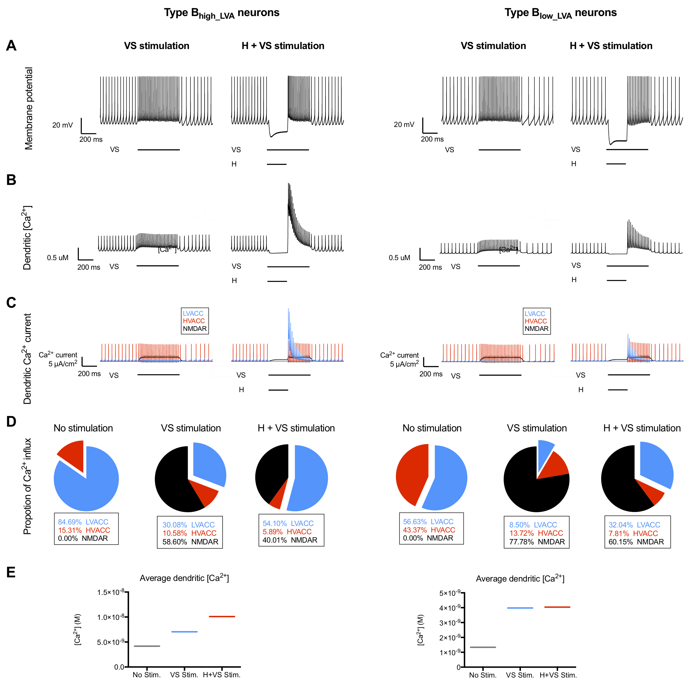

# Multiscale-Synaptic-Model Figure 4

## Components

- **run_high_LVA.hoc, run_low_LVA.hoc** 
	NEURON file to reproduce the results. Hyperpolarisation and excited stimulation happens in 1000 s in Type B high, low LVA neurons. Experiments include no VS no H stimulation, VS only stimulation, VS + H stimulation. LTS means high LVA. reduced means low LVA.

- **outputs/\*.txt** 
	outputs from NEURON model that records the following parameters
	Raw data. Recorded the dendB[3].v(0.5)	dendB[11].v(0.5)	dendB[3].cai(0.5)	dendB[11].cai	dend[3].lva	dend[3].hva	dend[3].nmda.

- **LVA_Ca_Average_550ms.py** 
	Python script to calculate the average Ca starting from 1000 ms to 1550 ms (total 550 ms) in all the simulation conditions.

- **LVA_Ca_Average_1000ms.py** 
	Python script to calculate the average Ca starting from 750 ms to 1750 ms (total 1000 ms) in all the simulation conditions.

## Instruction

1. You can copy, paste and run run_Normal.hoc in NEURON software directory to generate the experiments include no VS no H stimulation, VS only stimulation, VS + H stimulation..

2. To run the python script in this folder, ``python *.py``, to calculate the average Ca.

## Results

