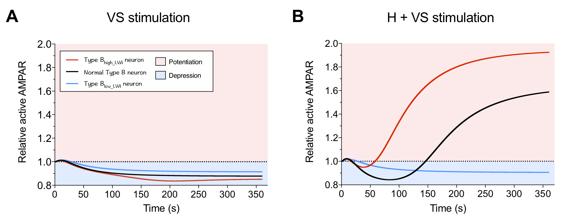

# Multiscale-Synaptic-Model Figure 6

## Figure

## Components

- **Model_MVN_TypeB_\*LVA_resting.cps** 
	Using the initial COPASI model in the main model folder multiscale-synaptic-model/model/chemical/Model_initial.cps, and setting the Ca2+ at 4.16e-9, 1.34e-9 M, which is the resting Ca level of Type B high LVA, low LVA neurons (calculated in Figure 4). Run the model for 1000 s to reach a stable state. This model is the initial model for the following simulation. 

- **\*.txt** 
	outputs from NEURON model from Figure 4, which records the Ca dynamics with and without hyperpolarisation of high, low LVA neurons.

- **SetupFolders.py** 
	Python script that takes in all the \*.txt in the current folder as the stimulation protocol and one \*.cps as the initial model, and output a sub-folder with new COPASI model that emmbeded the Ca dynamics into the initial COPASI model.

- **\*\_C** 
	Output from the SetupFolders.py script.

## Instruction

1. Run `python SetupFolders.py` to emmbed the Ca dynamics into the initial COPASI model. Parameters like start time, duration of each unit stimulation can be modifed in the scripts.

2. After get the \*\_C folders, running the COPASI files inside allows you to get the molecular dynmaics under the given the electraical stimulation.

